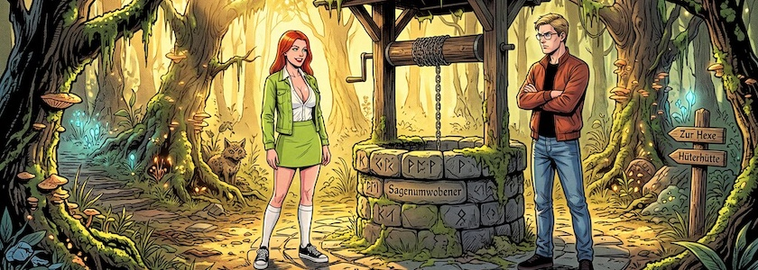
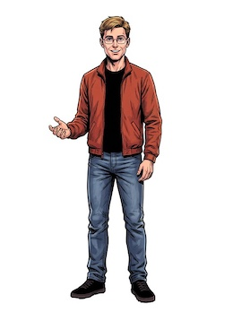
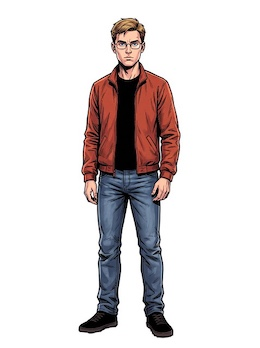
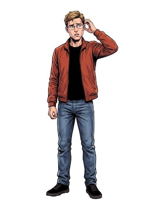
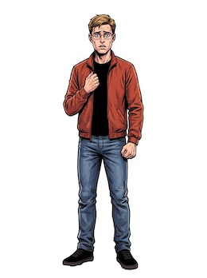

Wenn ich etwas angefangen habe, fällt es mir oft schwer, aufzuhören. Und so ging mir immer wieder durch den Kopf, dass [Babsi](https://kantel.github.io/posts/2026091602_babsi/) undbedingt auch noch einen Gefährten braucht. Daher habe ich mich noch einmal hingesetzt und in [Scenario](http://cognitiones.kantel-chaos-team.de/technikgeschichte/rechnerundnetze/scenario.html) eine männliche Figur für die Verwendung in *Visual Novels* generiert. Ich habe ihn »Hans Blond« genannt und als hochaufgelöste `.png`-Dateien mit freigestelltem Hintergrund [auf Itch.io hochgeladen](https://kantel.itch.io/hans-blond-visual-novel-project-4).

&nbsp;&nbsp;  
&nbsp;&nbsp;

Die obigen Bilder sind nur eine Auswahl, insgesamt besteht das Set aus 19 Posen.

**War sonst noch was?** Ach ja, weil ich gerade dabei war, habe ich [Babsi](https://kantel.itch.io/babsi-visual-novel-projekt-3) auch noch zwei weitere Posen spendiert, so dass ihr Set nun aus 32 Posen besteht.

Ihr könnt mit diesen Bildern anstellen, was Ihr wollt – sie sind schließlich KI generiert und damit frei von Urheberrechten –, doch würde ich mich freuen, wenn Ihr mir einen Link zu Euren Ergebnissen schickt, damit ich diese dann hier im ~~Blog~~ Kritzelheft vorstellen kann.

---

**Bild**: *[Babsi und Hans Blond](https://www.flickr.com/photos/schockwellenreiter/55537798439/)*, erstellt mit [OpenArt](https://openart.ai/home). Prompt: »*@Babsi stands in a clearing in the enchanted forest, in front of an old well. @Hans Blond stands beside the well, looking at her disapprovingly. @Babsi smiles back. The sun bathes the clearing in a warm light. Classic American comic book style. Language: German. No speech bubbles, text boxes, or headings.*« Modell: Nano Banana&nbsp;2.