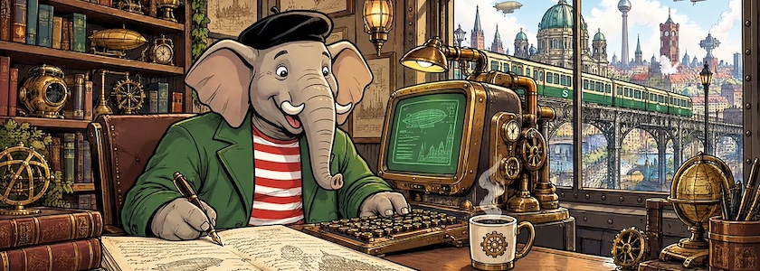

Duplizität der Ereignisse: Gestern [schrieb ich](https://kantel.github.io/posts/2026092001_marktext/), dass der freie (GPL 3.0) Markdown-Editor und Zettelkasten [Zettlr](http://cognitiones.kantel-chaos-team.de/webworking/auszeichnungssprachen/zettlr.html) in diesem ~~Blog~~ Kritzelheft schon hinreichend oft erwähnt wurde, heute erreichte mich die [Meldung](https://stadt-bremerhaven.de/zettlr-4-8-0-markdown-editor-bringt-admonitions-und-fehlerbehebung-bei-der-suche/), dass er ab sofort in der [Version 4.8.0 zum Download](https://zettlr.com/download) bereit stünde.

Die wichtigste Neuerung der Version ist die native Unterstützung von Admonitions, also diese hervorgehobenen Hinweis- und Infoboxen direkt im Text. Darüber hinaus haben die Entwickler an den Übersetzungen gearbeitet: Dank zahlreicher Zuarbeiten aus der Community soll die Lokalisierung in verschiedenen Sprachen nun deutlich runder laufen.

Ausführliche Details zu den Änderungen und zur Syntax der neuen Hinweisboxen haben die Entwickler zudem in einem [separaten Blog-Beitrag](https://zettlr.com/post/zettlr-480-released) aufgeschlüsselt.

Die neue Version steht kostenlos über die [Website der Entwickler](https://zettlr.com/) sowie [bei GitHub](https://github.com/Zettlr/Zettlr/releases/tag/v4.8.0) zum Download bereit.

---

**Bild**: *[Qumbo schreibt](https://www.flickr.com/photos/schockwellenreiter/55539365311/)*, erstellt mit [OpenArt](https://openart.ai/home). Prompt: »*@Qumbo sits at a desk in front of an antiquated, steampunk-style computer, typing on a keyboard. Lying on the desk in front of him is a gigantic notebook, in which he is jotting down notes with an old-fashioned fountain pen. Beside the keyboard sits a mug of steaming coffee. Shelves crammed with books and steampunk knick-knacks line the walls.Through a window, one looks out upon a steampunk version of Berlin with an elevated old-fashioned railway in a steampunk style, but in the colors of the Berlin S-Bahn. Colored classic American comic style. Language: German. No speech bubbles, no textboxes. No German flags.*« GPT Image&nbsp;2.5.