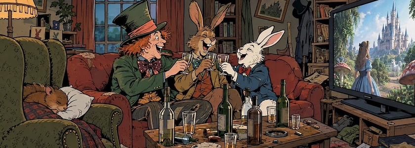

Der [VLC Media Player](http://cognitiones.kantel-chaos-team.de/multimedia/video/vlc.html) (kurz: VLC) ist ein freier (GPL), plattformübergreifender (Windows, macOS, Linux) Mediaplayer, der gefühlt alle Audio- und Videoformate spielt, nahezu alle Codecs beherrscht und sich nicht um DRM schert. Daneben kann er auch als Streamingserver, Konvertierungstool oder Bildschirmrekorder fungieren. Hinter dem schlichten Interface, das sich in den letzten Jahren kaum verändert hat, steckt eine der ausgereiftesten Open-Source-Software-Lösungen überhaupt.

Nun hat er ein Update auf die [Version 3.0.24](https://code.videolan.org/videolan/vlc/-/raw/3.0.x/NEWS) erhalten. Mit diesem Update wurden viele Bibliotheken und `dlls` aktualisiert und etliche Sicherheitskorrekturen vorgenommen. Außerdem verwendet der VLC nun FFmpeg&nbsp;8.1.

Die aktuelle Version kann [hier heruntergeladen](https://get.videolan.org/vlc/3.0.24/) werden.

---

**Bild**: *[Die (etwas andere) Teeparty](https://www.flickr.com/photos/schockwellenreiter/55544958310/)*, erstellt mit [ChatGPT](https://chatgpt.com/images). Prompt: »*Der verrückte Hutmacher, der Märzhase und das weiße Kaninchen sitzen auf dem Sofa in einem ziemlich unaufgeräumten Zimmer und schauen Fernsehen auf einem großen Monitor. Im Fernsehen läuft eine märchenhafte Fantasy-Verfilmung. Auf dem Tisch vor dem Sofa stehen ein paar Flaschen und ein paar halbgefüllte Gläser. Der Hutmacher, der Märzhase und das weiße Kaninchen lachen und prosten sich gegenseitig zu. In einem Ohrensessel neben dem Sofa schläft die Haselmaus, den Kopf auf einem weißen Kissen. Klassischer Franko-Belgischer Comicbuch-Stil, Sprache: Deutsch. Keine Sprechblasen, keine Überschriften und keine Textboxen. Aspect-Ratio: 21:9.*« Modell: GPT Image&nbsp;2.5.