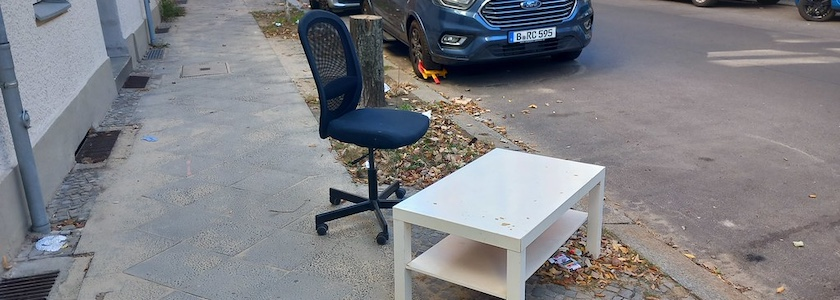
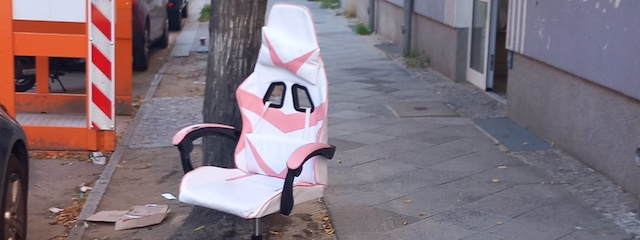

Das Wetter in Berlin-Neukölln ist in diesen Tagen für einen Frühherbst angenehm warm und sonnig. Und so war es kein Wunder, dass einige Büromöbel ihren Arbeitsplatz ins Freie auf die Neuköllner Bürgerstraße verlegten.

Ein wenig später stießen auch noch die Gamer (-Sitzgelegenheiten) dazu.

---

**Photos** ([cc](https://creativecommons.org/licenses/by-sa/4.0/deed.de)) 2026: *[Jörg Kantel](http://cognitiones.kantel-chaos-team.de/cv.html)*