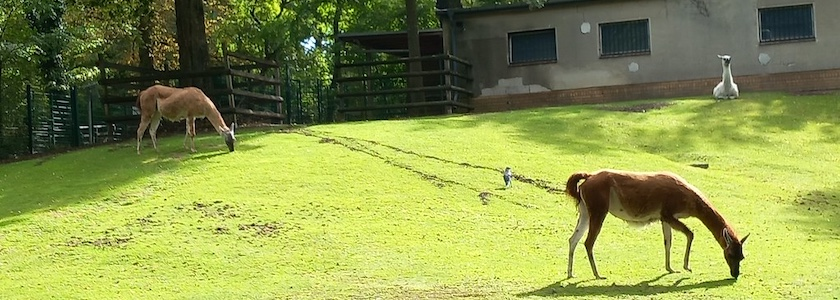

Wer aus Kreuzberg kommend von der Straße »Hasenheide« in den [Volkspark Hasenheide](https://de.wikipedia.org/wiki/Volkspark_Hasenheide) einbiegt, lässt den Großstadtrummel Kreuzbergs und Neuköllns erstaunlich schnell hinter sich. Hinter einer Minigolfanlage führt ein kleiner Pfad zwischen Gehegen hindurch. Enten, Gänse, Schafe, Lamas und Emus sind zu sehen, dazu viele weitere Tiere. Ein Insektenhotel und ein alter Baucontainer, in dem Bienen leben, stehen am Weg. Weiter hinten liegt ein Spielplatz. Das ist der **[Tierpark Neukölln](https://tierpark-neukoelln.berlin/)**.

Der Tierpark Neukölln wird seit 2007 auf Teilflächen des Volkspark Hasenheide aufgebaut. Davor gab es hier schon ein kleines Tiergehege mit Damhirschen, Schafen und Pfauen. Kernstück des Tierparks ist das seit 1953 bestehende Kleintiergehege, das seinerzeit auf Initiative des damaligen Bezirksbürgermeisters *Kurt Exner* (SPD) angelegt worden war, sowie der angrenzende Wirtschaftshof.

Nach der Einrichtung des Kleintiergeheges 1953 wurde im darauffolgenden Jahr mit der Besiedlung begonnen. Die ersten Bewohner der Anlage waren Damwild, je ein Fuchs und eine Ziege sowie einige Kaninchen, Zwerghühner, Goldfasanen und Tauben. 1955 kamen dann Wildschweine hinzu, die aus dem Volkspark Jungfernheide stammten. In den 1960er Jahren wuchs der Bestand um Schildkröten, Eichhörnchen, Meerschweinchen sowie verschiedene Greifvögel, die von Berliner Bürgern gestiftet wurden. Bis heute ist der Park im ständigen Wandel, da Schritt für Schritt neue Gehege und Volieren artgerecht gebaut werden.

Außerdem bemüht sich der Tierpark Neukölln um die Erhaltung und Zucht der von ihm gehaltenen, vom [Aussterben bedrohten Haustierrassen](https://tierpark-neukoelln.berlin/rundgang/haustiere/) und arbeitet eng mit der Gesellschaft zur Erhaltung alter und bedrohter Haustierrassen&nbsp;e.V. zusammen. Er ist seit 2015 anerkannte [Nutztier-Arche](https://tierpark-neukoelln.berlin/tierpark-neukoelln-ist-jetzt-nutztier-arche/).

Seit Januar 2012 betreibt die Union Sozialer Einrichtungen (USE) gemeinnützige GmbH die Tierhaltung im Tierpark Neukölln.

Der Tierpark Neukölln ist von **April bis Oktober** täglich von **9:00&nbsp;Uhr bis 18:00&nbsp;Uhr** und von **November bis März** täglich von **9:00&nbsp;Uhr bis 15:30&nbsp;Uhr** geöffnet. Der **Eintritt ist kostenlos**, [Spenden](https://tierpark-neukoelln.berlin/spenden/) werden aber gerne entgegengenommen.

### Verwendete Quellen und Literatur

- Bezirksamt Friedrichshain-Kreuzberg: *[Ein Tag, zwei Arbeitswelten: Schichtwechsel im Tierpark Neukölln](https://www.berlin.de/ba-friedrichshain-kreuzberg/aktuelles/bezirksticker/2026/schichtwechsel-tierpark-neukoelln-1715297.php)*, 17.&nbsp;September&nbsp;2026
- Tierpark Neukölln: *[Geschichte](https://tierpark-neukoelln.berlin/der-tierpark/geschichte/)*, aufgerufen am 24.&nbsp;September&nbsp;2026
- Wikipedia: *[Volkspark Hasenheide](https://de.wikipedia.org/wiki/Volkspark_Hasenheide)*, aufgerufen am 24.&nbsp;September&nbsp;2026

---

**Photo** ([cc](https://creativecommons.org/licenses/by-sa/4.0/deed.de)) 2026: *[Jörg Kantel](http://cognitiones.kantel-chaos-team.de/cv.html)*