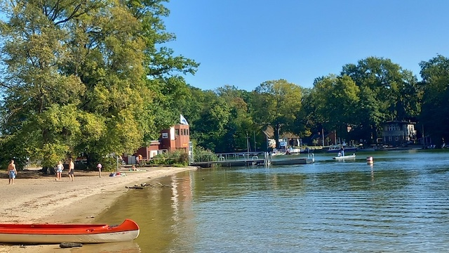

Am letzten Sonntag waren die liebste aller Freundinnen und ich bei strahlendem Spätsommerwetter am Tegeler See spazieren, und zwar ging es von Tegelort nach Konradshöhe (und wieder zurück). Wir besuchten dort den Arbeiterstrand, eine kostenlose, unbewirtschaftete Badestelle am Westufer des Tegeler Sees.

Während die [Bürgerablage in Spandau](https://kantel.github.io/posts/2026060401_buergerablage/) ihren Namen eben nicht davon herleiten kann, dass sich dort Bürger in der Sonne ablegten und bräunen ließen, bekam der Arbeiterstrand tatsächlich seinen Namen von den Tegeler Arbeitern, die mit jedem Pfennig rechnen mussten und nicht einsahen, für das Baden im nebenan liegenden, seit 1920 bewirtschafteten und kostenpflichtigen Strandbad Tegel Geld zu zahlen. Sie wichen daher auf den unentgeltlichen, frei zugänglichen Sandabschnitt südlich vom Strandbad an der Scharfenberger Fähre aus.

Der Ort hat daher bis heute seinen traditionsreichen Namen »Arbeiterstrand« behalten, obwohl er inzwischen eine offizielle, freie Badestelle mit DLRG-Wasserrettung ist.

In der Fährstelle zwischen dem Ufer und Scharfenberg liegt eine sehr enge Fahrrinne, die nicht nur von kleinen Booten sondern auch von sehr großen Ausflugsbooten wie die »Havelqueen« oder »Moby Dick« passiert wird. Es gibt also immer was zu sehen, sogar richtig große Flußkreuzfahrtschiffe kann man an manchen Tagen beobachten.

Mit öffentlichen Verkehrsmitteln erreicht man an die Badestelle, wenn man mit dem 222er Bus ab U-Bahnhof Alt-Tegel oder auch ab S-Bahnhof Tegel (oder auch ab S-Bahnhof Waidmannslust) bis zur Haltestelle Jörsstraße fährt. Dieser in Fahrtrichtung geradeaus folgend gelangt man in etwa 15 Minuten an einen Waldweg, der direkt zur Fähre und zum Arbeiterstrand führt.

Einen Imbiss oder ähnliches besitzt die Badestelle leider nicht und das nahegelegene Strandbad Tegel mit seinen Imbissbuden hatte bei unserem Besuch Ende September schon geschlossen. Läuft man jedoch von der Badestelle Arbeiterstrand am Seeufer südlich weiter in Richtung Tegelort erreicht man nach etwa zwanzig Minuten Fußweg die [Terrassen am See](https://kantel.github.io/posts/2026060202_terrassen_am_see/), die seit dem 20.&nbsp;Mai dieses Jahres wieder geöffnet haben. Von dort hat man einen herrlichen Blick über den Tegeler See mit seinen Inseln.

Die liebste aller Freundinnen und ich haben gestern dort in der Nachmittagssonne das Bier nach unserem Ausflug zum Arbeiterstrand sehr genossen.

### Verwendete Quellen und Literatur

- Fieselfux: *[Badestelle gegenüber Scharfenberg](https://fieselfux.wordpress.com/category/96-bezirke/konradshohe/)*, Berlin erkunden, 8.&nbsp;September&nbsp;2016
- Jörg Kantel: *[Atlas Curiosa: Die Terrassen am See in Tegelort](https://kantel.github.io/posts/2026060202_terrassen_am_see/)*, Der Schockwellenreiter, 2.&nbsp;Juni&nbsp;2026
- ders.: *[Atlas Curiosa: Die Bürgerablage in Berlin-Spandau](https://kantel.github.io/posts/2026060401_buergerablage/)*, Der Schockwellenreiter, 4.&nbsp;Juni&nbsp;2026
- Wiki Faltboot.org: *[Fahrt XIII und XIV: Spandau - Oranienburg - OderHavelKanal - Finowkanal](https://wiki.faltboot.org/wiki/index.php?title=Fahrt_XIII_und_XIV:_Spandau_-_Oranienburg_-_OderHavelKanal_-_Finowkanal_(Keller_1925_und_1929)#cite_note-28)*, Keller 1925 und 1929, Fußnote&nbsp;28

---

**Photos** ([cc](https://creativecommons.org/licenses/by-sa/4.0/deed.de)) 2026: *[Jörg Kantel](http://cognitiones.kantel-chaos-team.de/cv.html)*