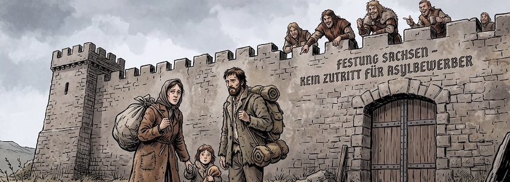

[Sachsens Innenminister *Armin Schster* (CDU) stellt das Grundrecht auf Asyl in Frage](https://www.mdr.de/nachrichten/sachsen/news-migration-grundgesetz,innenminister-grundrecht-asyl-100.html). Nach einem Vier-Punkte-Plan seines Ministeriums soll der individuelle Asylanspruch durch jährliche Kontingente ersetzt werden. »Die Aufnahmekapazität in Städten und Gemeinden muss der Maßstab sein für den Umfang, in dem Deutschland künftig Asyl gewährt«, teilte Schuster dem MDR SACHSEN mit.

Auf europäischer Ebene schlägt Schuster ebenfalls Änderungen vor: »Die Europäische Menschenrechtskonvention muss entsprechend angepasst werden, weil das Sicherheitsinteresse unseres Landes höher gewichtet werden sollte als das Bleibeinteresse von Straftätern«, heißt es in dem Papier des Innenministers. Darüber hinaus plädiert Schuster für strengere Einbürgerungsregeln.

Der migrationspolitische Sprecher der Linksfraktion, *Nam Duy Nguyen*, nannte Innenminister Schusters Pläne »höchstwahrscheinlich rechtswidrig« und bezeichnete den individuellen Asylanspruch als Menschenrecht und kritisiert besonders Schusters Vorschlag für eine flexible Obergrenze: »Asyl ist ein Menschenrecht. Kein Kontingent, das je nach Kassenlage auf- oder zugedreht wird«. Außerdem halte das Deutsche Institut für Menschenrechte laut Nguyen Asyl-Obergrenzen für unvereinbar mit Grund- und Menschenrechten, internationalem Flüchtlingsrecht und EU-Recht.

Freiheit stirbt zentimeterweise. Die Pläne von Sachsens Innenminister sind ein weiterer Schritt in Richtung Barbarei.

---

**Bild**: *[Festung Sachsen](https://www.flickr.com/photos/schockwellenreiter/55558728578/)*, erstellt mit [OpenArt](https://openart.ai/home). Prompt: »*A woman, a man, and a child in worn-out clothing, carrying bundled-up luggage, stand before a high, forbidding fortress wall bearing the inscription "Fortress Saxony – No Entry for Asylum Seekers." From the battlements, men with a barbaric appearance look down mockingly at the group. Franco-Belgian comic book style. German language; no speech bubbles, no text boxes, no headings.*« Modell: Nano Banana&nbsp;2.