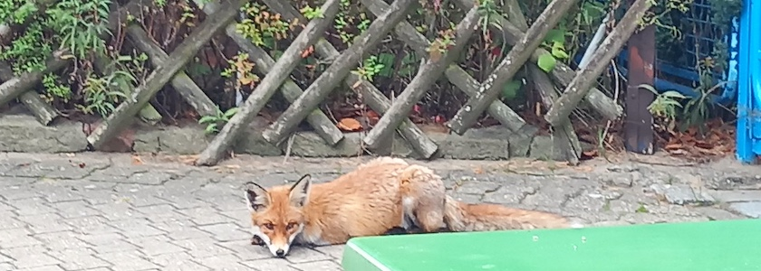

Nach all den unerfreulichen Ausflügen heute in die Niederungen der Barbarei und Politik nun noch etwas Erfreuliches aus der Heiligenseer Tierwelt: Dieser Fuchs lief mir am Sonnabend im Garten des Restaurants im [Seebad Heiligensee](https://www.facebook.com/profile.php?id=100088142492303) *(Facebook-Link)* vor die Linse.

Nach den [Wildschweinchen mit ihren Frischlingen](https://kantel.github.io/posts/2026051801_tierische_begegnung/) war es eine weitere tierische Begegnung in Berlin-Heiligensee.

---

**Photo** ([cc](https://creativecommons.org/licenses/by-sa/4.0/deed.de)) 2026: *[Jörg Kantel](http://cognitiones.kantel-chaos-team.de/cv.html)*