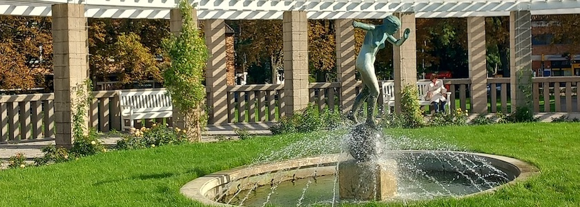

Seit Mai dieses Jahres erstrahlt der [Zeltinger Platz](https://de.wikipedia.org/wiki/Zeltinger_Platz) in der Berliner Gartenstadt [Frohnau](https://de.wikipedia.org/wiki/Berlin-Frohnau) nach einer [aufwendigen Sanierung](https://www.berlin.de/ba-reinickendorf/aktuelles/pressemitteilungen/2026/pressemitteilung.1670578.php) wieder im neuen Glanz. Zentrales Element des Platzes ist die halbrunde Pergola mit einem Springbrunnen, in dessen Mitte eine bronzene, lebensgroße, weibliche Aktfigur auf einer Kugel balanciert.

Diese vom Berliner Bildhauer *Otto Maerker* 1932 geschaffene Plastik stellte man auf einen hohen Mittelsockel. Sie war allerdings wohl noch nicht von einem Kranz aus Wasserfontänen umgeben. Während des Zweiten Weltkrieges wurde die Kugelläuferin 1942 als Metallspende für die NS-Rüstungsindustrie eingeschmolzen. Nach dem Krieg zierte für viele Jahre der kleine Bär von *Renée Sintenis* den Brunnensockel. Im Zuge der Restaurierung der Brunnenanlagen des Zeltinger Platzes entstand ein Neuguss der Plastik von Maerker. Ihn hatte der Berliner Bildhauer und Restaurator *Harald Haacke* im Auftrag des Bezirksamts Reinickendorf nach einem Gipsoriginal von 1931 anfertigt, das von der Witwe des Künstlers zur Verfügung gestellt wurde. Die Figur setzte man im Brunnenbecken wieder auf einen Sockel und umgab sie nun mit einem Wasserspiel aus Bogenstrahlen. Die Einweihung der zum Wahrzeichen Frohnaus gewordenen Kugelläuferin erfolgte 1980 und der kleine Bär nahm seinen heutigen Platz an der Wiltinger Straße ein.

Die mit Geschick und Anmut auf einer Kugel balancierende Frauengestalt lässt so Anklänge an Art Déco-Motive und der Reformbewegung Jugend um 1900 erkennen, wie zum Beispiel die Kugelläuferin von *Fidus* (d.i. *Hugo Höppner*) von 1894. Der von Harald Haacke gefertigte Neuguss entspricht weitgehend dem Original, wenn er auch etwas voluminöser ausgefallen ist.

### Verwendete Quellen und Literatur

- Bezirksamt Reinickendorf: *[Zeltinger Platz in Frohnau erstrahlt nach Sanierung in neuem Glanz](https://www.berlin.de/ba-reinickendorf/aktuelles/pressemitteilungen/2026/pressemitteilung.1670578.php)*, Pressemitteilung vom 12.&nbsp;Mai&nbsp;2026
- Bildhauerei in Berlin: *[Die Kugelläuferin](https://bildhauerei-in-berlin.de/bildwerk/die-kugellaeuferin-5026/)*, aufgerufen am 30.&nbsp;September&nbsp;2026
- Katrin Lesser: *[Gartenstadt Frohnau](https://www.katrin-lesser.de/gutachten/gartenstadt-frohnau/)*, Gutachten 1998
- Denise Sturm: *[Zeltinger Platz in Frohnau: Aufwendige Sanierung abgeschlossen](https://www.entwicklungsstadt.de/zeltinger-platz-in-frohnau-nach-sanierung-wieder-zugaenglich/)*, Entwicklungsstadt, 16.&nbsp;Mai&nbsp;2026
- Michael Türschmann: *[Der Zeltinger Platz in Frohnau](https://radio-weblogs.com/0109045/2006/06/11.html)*, Kunstspaziergänge, 11.&nbsp;Juni&nbsp;2006
- Wikipedia: *[Zeltinger Platz](https://de.wikipedia.org/wiki/Zeltinger_Platz)*, aufgerufen am 30.&nbsp;September&nbsp;2026

---

**Photo** ([cc](https://creativecommons.org/licenses/by-sa/4.0/deed.de)) 2026: *[Jörg Kantel](http://cognitiones.kantel-chaos-team.de/cv.html)*