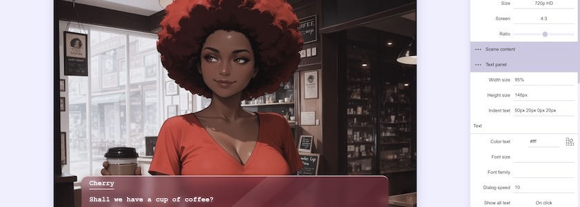

Ich unterlasse heute mal mein gewohntes Gejammere, dass ich [schon wieder](https://kantel.github.io/posts/2026090401_tuesday_js_release_60/) ein Update von [Tuesday&nbsp;JS](https://kirilllive.github.io/tuesday-js/#de) verpasst habe, der kleinen und freien (MIT-Lizenz) JavaScript-basierten Engine für interaktive Geschichten und *Visual Novels*, die mir allein schon deswegen so sympathisch ist, weil ihre Oberfläche mich immer ein wenig an [Twine](http://cognitiones.kantel-chaos-team.de/multimedia/spieleprogrammierung/twine2.html) erinnert.

Dieses Mal ist es das Update auf die [Version&nbsp;61](https://github.com/Kirilllive/tuesday-js/releases/tag/61.0.0) und es ist auch erst zwei Wochen alt. Es ist ein Wartungs-Release mit einigen Bugfixes. Wichtigste Änderung ist die Umstellung von der alten Apache-2.0-Lizenz auf eine MIT-Lizenz.

Weiterhin besteht allerdings mein Wunsch, endlich mal mit dieser Engine etwas anzustellen, das über einen kurzen Test hinausgeht. Vielleicht sollte ich die [jüngst](https://kantel.github.io/posts/2026060301_konsistente_charaktere/) [erschaffenen](https://kantel.github.io/posts/2026061002_maid_mary/) [Figuren](https://kantel.github.io/posts/2026091602_babsi/) [dazu verwenden](https://kantel.github.io/posts/2026092101_hans_blond/)? *Still digging!*

