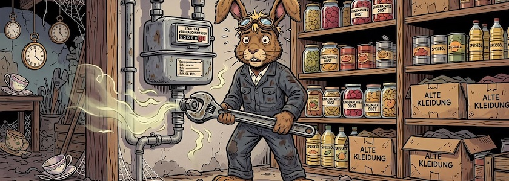

Anfang August musste ich gezwungenermaßen durch die [NBB Netzgesellschaft Berlin-Brandenburg](https://de.wikipedia.org/wiki/NBB_Netzgesellschaft_Berlin-Brandenburg) den Austausch meines funktionierenden Gaszählers vornehmen lassen. Unmittelbar danach – ich koche nicht jeden Tag – funktionierte der Gasherd bei mir nicht mehr korrekt (mal ging die Gasflamme normal an, mal brannte sie nur ganz klein, alles ohne dass ich an den Reglern drehte). Einen Zusammenhang mit dem Wechsel des Gaszählers hatte ich nicht angenommen, da ich irrigerweise davon ausging, dass die NBB nur qualifiziertes Fachpersonal mit solchen Aufgaben betraut.

Da mein Gasherd nun schon einige Jahre auf dem Buckel hatte, habe ich auf Anraten des Hausinstallateurs einen neuen Gasherd bestellt. Der wurde heute geliefert und angeschlossen. Bei der Inbetriebnahme zeigte er allerdings die gleichen Macken wie mein altes Gerät.

Stutzig geworden, überprüfte der Klempner den Gaszähler und stellte fest, dass **die Gaszufuhr nach der Neuinstallation nur halb geöffnet** worden war. Nach Behebung dieses Umstandes funktionierte der neue Gasherd wie gewünscht (wie vermutlich auch der alte Gasherd funktioniert hätte).

Nun beschäftigt mich die Frage, wer mir die nicht unbeträchtlichen Kosten ersetzt, die die völlig unnötige Anschaffung und Installation eines neuen Gasherdes verursacht haben? Es geht schließlich um knapp 1.000 Euro, die mich der Fehler eines Mitarbeiters der NBB gekostet hat.

Eine Beschwerde an die NBB ist raus. Viel Hoffnung mache ich mir allerdings nicht, denn in Deutschland haftet immer nur der kleine Mensch für seine Fehler, niemals aber die großen, kommerziellen Gesellschaften.

Ich werde allerdings, bis zur Klärung dieser Angelegenheit, niemanden mehr von der NBB in meine Wohnung oder in meinen Keller lassen. Denn verarschen kann ich mich alleine.

---

**Bild**: *[Monteur der NBB-Netzgesellschaft bei der Arbeit](https://www.flickr.com/photos/schockwellenreiter/55562799323/)*, erstellt mit OpenArt. Prompt: »*The March Hare stands in mechanic's overalls—aviator goggles pushed up onto his forehead—holding a wrench in front of a gas meter and trying in vain to unscrew it. Gas is seeping out of the threaded connection. In the background, cellar shelves hold canned goods, alongside a few cardboard boxes filled with old clothes. The March Hare looks even more bewildered than usual. Franco-Belgian comic book style. Language: German; no speech bubbles, no text boxes, no headings.*« Modell: Nano Banana&nbsp;2.