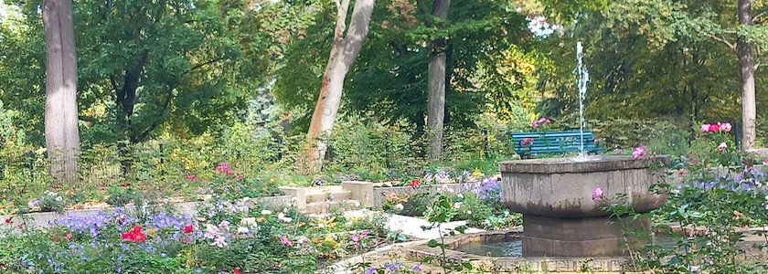
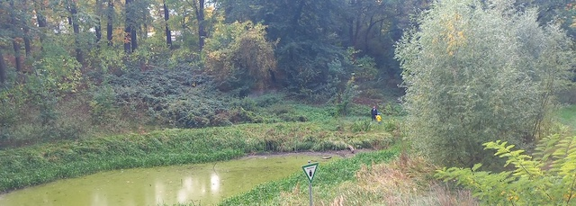
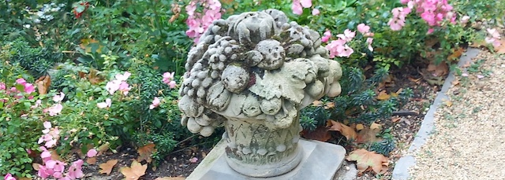

Der Franckepark in Tempelhof zählt mit etwa sechs Hektar Fläche zu den größten Parks im Ortsteil Tempelhof. Er ist einer der ältesten Grünanlagen des Bezirks. *Theodor Francke* (1830–1896) besaß in der Nähe eine Bleiche für Elfenbein. Da er Platz für das Material benötigte, wurde die Fläche zum Lager ausgebaut. Im Jahr 1875 gestaltete *Jonathan Kaehler* im Auftrag der Familie Francke das Gelände als Privatpark um, unter anderem entstand ein Rodelhügel. Franckes Erben verschenkten den Park 1924 an die Gemeinde Berlin, die eine Neugestaltung vornahm. Unter dem Tempelhofer Bezirksgartendirektor *Rudolf Fischer* wurden in den Jahren 1925–1928 Areale mit landschaftlichem Charakter, ein Rosengarten sowie ein Damwild­gehege angelegt.

Fischer ließ darüber hinaus noch eine Tanzfläche, ein Parkcafé, eine Fasanerie und ein Vogelhaus errichten.

Der Rosengarten als Eingangsbereich von der Siedlung »Am Franckepark« wurde 2026 nach historischem Vorbild saniert. Auch der Brunnen, der jahrzehntelang außer Betrieb war, nachdem eine zwischenzeitlich ergänzte Bronzefigur (Ziegenböckchen) und auch mehrere Ersatzvarianten eingeschmolzen oder gestohlen wurden, sprudelt wieder. Bei unserem Besuch am 3.&nbsp;Oktober standen außerdem noch zahlreiche Rosen und Stauden in Blüte.

Markant ist die tiefe Senke, die den Park prägt. Dort befand sich bis 1906 als *Krummer Pfuhl* einer der Toteis-Teiche, die noch heute Tempelhof bereichern. 1861 wurde hier eine Badeanstalt mit zwei abgetrennten Bereichen für Damen und Herren eröffnet. Beim Bau des Teltowkanals sank der Grundwasserspiegel. Die Senke fiel weitgehend trocken, es blieb ein kleiner Tümpel, das flächenhafte Naturdenkmal *Francketeich*. Von 1954 bis 2019 war die Senke Teil des ehemaligen Wildgeheges. Die Auflösung des Damwildgeheges nach fast 90 Jahren wurde Ende September 2018 von der Bezirksverordnetenversammlung beschlossen. Im Oktober 2019 wurde die Umgestaltung des Parks abgeschlossen. Die Umzäunung des ehemaligen Tiergeheges wurde entfernt, die Senke und der Francketeich wurden renaturiert.

Am 9. Mai 2026 feierte man die Wiedereröffnung des Rosengartens. Die Neugestaltung wurde mit Mitteln des Programms Nachhaltige Erneuerung umgesetzt. Nun glänzt er wieder als repräsentativer Eingang zum Park und als Schmuckgarten, der sich an den ursprünglichen Vorgaben orientiert.

Der Franckepark ist Teil eines größeren Grünzugs im Ortsteil Tempelhof. Er ist mit dem Alten Park, dem Lehnepark und Bosepark durch grüne Wege verbunden. Dadurch ergibt sich ein kilometerlanges hügeliges Band von schönen Spazierwegen durch den Ortsteil Tempelhof.

**Anschrift**: Theodor-Francke-Park, Alt-Tempelhof 24, 12099 Berlin

### Literatur und Quellen

- Bezirksamt Tempelhof-Schöneberg: *[Sanierung des Rosengartens im Franckepark](https://mein.berlin.de/vorhaben/2025-01098/)* ([Plan](https://mein.berlin.de/projekte/sanierung-des-rosengartens-im-franckepark/)), Mein Berlin, zuletzt bearbeitet am 2.&nbsp;September&nbsp;2026
- Delia Güssefeld: *[Gartenhistorische Führung durch den Franckepark](https://www.dieheimatdelias.de/franckeparkinh.html)*, aufgerufen am 5.&nbsp;Oktober&nbsp;2026
- Amina Mendez: *[Der Franckepark – ein kühler Ort in Tempelhof](https://www.tempelhof-schoeneberg-zeitung.de/der-franckepark-ein-kuehler-ort-in-tempelhof/)*, Tempelhof-Schöneberg Zeitung, 31.&nbsp;Mai&nbsp;2026
- Museen Tempelhof-Schöneberg: *[BezirksTOUR: Elfenbein im Franckepark – Ein Rundgang zu kolonialer Ausbeutung und ihren Spuren in Tempelhof](https://museen-tempelhof-schoeneberg.de/events/bezirkstour-elfenbein-im-franckepark-ein-rundgang-zu-kolonialer-ausbeutung-und-ihren-spuren-in-tempelhof/)*, 13.&nbsp;Juni&nbsp;2026
- Olver Noffke: *[Durchatmen, wo früher Elfenbein gebleicht wurde. Franckepark in Berlin-Tempelhof](https://www.rbb24.de/kultur/beitrag/2026/06/berlin-tempelhof-franckepark-elfenbeinhaendler-theodor-francke-ausstellung-museum.html)*, rbb|24, 15.&nbsp;Juni&nbsp;2026
- Dajana Rubert: *[Kaum wiederzuerkennen: So hat sich der Franckepark in Tempelhof verändert](https://www.entwicklungsstadt.de/franckepark-fertig-15-000-neue-pflanzen-und-ein-alter-brunnen/)*, Entwicklungsstadt, 30.&nbsp;September&nbsp;2026
- Senatsverwaltung für Stadtentwicklung, Bauen und Wohnen: *[Denkmalgerechte Sanierung des Rosengartens im Franckepark](https://www.nachhaltige-erneuerung.berlin.de/neue-mitte-tempelhof/rosengarten-im-franckepark)*, Nachhaltige Erneuerung, aufgerufen am 5.&nbsp;Oktober&nbsp;2026
- Wikipedia: *[Franckepark](https://de.wikipedia.org/wiki/Franckepark)*, aufgerufen am 5.&nbsp;Oktober&nbsp;2026

---

**Photos** ([cc](https://creativecommons.org/licenses/by-sa/4.0/deed.de)) 2026: *[Jörg Kantel](http://cognitiones.kantel-chaos-team.de/cv.html)*