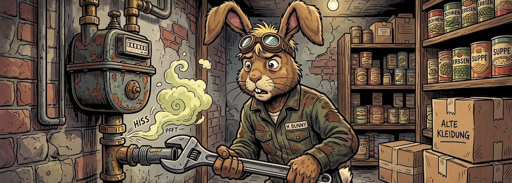

Es kam genau so wie ich es vorhergesagt hatte: Die [NBB Netzgesellschaft Berlin-Brandenburg](https://de.wikipedia.org/wiki/NBB_Netzgesellschaft_Berlin-Brandenburg) ist nicht nur [inkompetent und teuer](https://kantel.github.io/posts/2026100103_nbb_netzgesellschaft/), sondern ihr Name ist auch Hase, sie wohnt ~~im Walde~~ in Schöneberg, sie weiß von nichts und will es auch nicht gewesen sein.

Aber -- wie sie mir mit wohlgesetzten, aber hohlen Worten mitteilten -- tut es ihr unendlich leid, dass ich wegen des Versagens einer ihrer Mitarbeiter auf Kosten in Höhe von knapp **1.000&nbsp;Euro** sitzenbleibe. Aber die müsste ich wohl selber tragen. Denn wo kämen wir hin, wenn in Deutschland die großen, kommerziellen Gesellschaften für ihre Fehler haften müssten? Das wäre ja fast schon Kommunismus!

---

**Bild**: *[Monteur der NBB-Netzgesellschaft: Sein Name ist Hase](https://www.flickr.com/photos/schockwellenreiter/55561675787/)*, erstellt mit [OpenArt](https://openart.ai/home). Prompt: »*The March Hare stands in mechanic’s overalls—aviator goggles pushed up onto his forehead—holding a wrench in front of a gas meter and trying in vain to unscrew it. Gas is seeping out of the threaded connection. In the background, cellar shelves hold canned goods, alongside a few cardboard boxes filled with old clothes. The March Hare looks even more bewildered than usual. Franco-Belgian comic book style. Language: German; no speech bubbles, no text boxes, no headings.*« Modell: Nano Banana&nbsp;2.