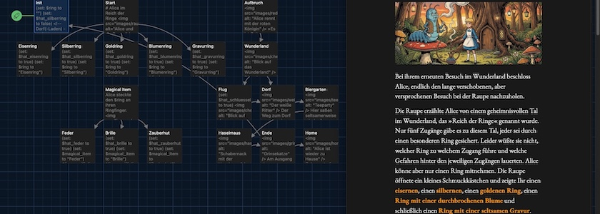

Nach einer kurzen Pause möchte ich meine kleine Reihe über [Twine](http://cognitiones.kantel-chaos-team.de/multimedia/spieleprogrammierung/twine2.html), der kleinen, freien Engine für interaktive Geschichten (und vielem mehr) und dem (Default-) Storyformat [Harlowe](https://twine2.neocities.org/) fortsetzen. Wie schon im [letzten Tutorial](https://kantel.github.io/posts/2026091001_alice_tutorial_5/) geht es hier speziell um den Einsatz von **Variablen**, um einige (neue) **Makros** und auch wieder um **Hooks**, die »Haken«, an denen Makros hängen.

In diesem Beispiel holt Alice ihren lange verschobenen Besuch bei der kiffenden, blauen Raupe nach, die sie auf eine abenteuerliche Reise in das »Reich der Ringe« schickt. Doch der Reihe nach:

Auch dieses Geschichte beginnt mit der Startpassage `Init`, die nur aus einer Menge von Variablendeklarationen mit `set:` und dem Makro `go-to:` besteht:

~~~twine
(set: $ring to "")
(set: $hat_silberring to false) <!-- Dorf(-Laden) -->
(set: $hat_goldring to false)   <!-- Baum -> Frosch -->
(set: $hat_blumenring to false) <!-- Humpel Pumpel -->
(set: $hat_gravurring to false) <!-- Bibliothek -->
(set: $hat_eisenring to false)  <!-- Baum -> Müder Ritter -->
(set: $magical_item to "")
(set: $hat_brille to false)
(set: $hat_feder to false)
(set: $hat_zauberhut to false)
(set: $hat_schluessel to false)

(go-to: "Start")
~~~

Die Kommentare (`<!-- -->`) in den Zeilen zwei bis sechs sind eine Erinnerung an mich, wie die Geschichte vielleicht später einmal weitergehen soll, und soll Euch zeigen, dass Harlowe HTML-Kommentare akzeptiert.

Das Makro `go-to: "Start"` schickt die Spielerin oder den Spieler ohne Interaktion sofort zur Passage `Start`, wo die Geschichte dann wirklich losgeht[^1]:

[^1]: Die separate `Init`-Passage wäre von der Logik der Geschichte nicht notwendig gewesen, die Variablen-Deklarationen hätten auch in die `Start`-Passage gehören können, aber ich mag es einfach, wenn alle Deklarationen separat in einer eigenen Passage vorgenommen werden.

~~~twine
# Alice im Reich der Ringe

Bei ihrem erneuten Besuch im Wunderland beschloss Alice, endlich den lange 
verschobenen, aber versprochenen Besuch bei der Raupe nachzuholen.

Die Raupe erzählte Alice von einem geheimnisvollen Tal im Wunderland, das 
»Reich der Ringe« genannt wurde. Nur fünf Zugänge gäbe es zu diesem Tal, jeder 
sei durch einen besonderen Ring gesichert. Leider wüßte sie nicht, welcher Ring 
zu welchem Zugang führe und welche Gefahren hinter den jeweiligen Zugängen 
lauerten. Alice könne aber nur einen Ring mitnehmen. Die Raupe öffnete ein kleines 
Schmuckkästchen und zeigte Ihr einen [[eisernen->Eisenring]], einen 
[[silbernen->Silberring]], einen [[goldenen Ring->Goldring]], einen 
[[Ring mit einer durchbrochenen Blume->Blumenring]] und schließlich einen 
[[Ring mit einer seltsamen Gravur->Gravurring]].
~~~

Ich habe dieser Geschichte das [gleiche Stylesheet](https://kantel.github.io/posts/2026091001_alice_tutorial_5/#das-stylesheet) wie im letzten Tutorial spendiert, daher werde die Überschriften mit dem Font *Berkshire* dargestellt, die Brotschrift ist *EB Garamond* und die Links sind <b style="color:#ff9900">orange</b>.

Ansonsten passiert nicht viel Neues in dieser Passage, das wirklich Neue passiert erst in den folgenden Passagen, die alle aus fast dem gleichen Text bestehen. Zuerst die Passage `Eisenring`:

~~~twine
(set: $hat_eisenring to true)
(set: $ring to "Eisenring")
(display: "Magical Item")
~~~

Dann die Passage `Silberring`:

~~~twine
(set: $hat_silberring to true)
(set: $ring to "Silberring")
(display: "Magical Item")
~~~

Die Passage `Goldring`:

~~~twine
(set: $hat_goldring to true)
(set: $ring to "Goldring")
(display: "Magical Item")
~~~

Die Passage `Blumenring`:

~~~twine
(set: $hat_blumenring to true)
(set: $ring to "Blumenring")
(display: "Magical Item")
~~~

Und *last but not least* die Passage `Gravurring`:

~~~twine
(set: $hat_gravurring to true)
(set: $ring to "Gravurring")
(display: "Magical Item")
~~~

In diesen Passagen werden jeweils die entsprechenden Variablen gesetzt und dann wird als gemeinsamer Nenner mit dem Makro `display: "Magical Item"` die Passage `Magical Item` in jede dieser Passagen eingebunden. Das Makro `display:` ist dafür gedacht, wiederkehrende Textpassagen in die eigentliche Passage einzubinden, daher erstellt Twine im Storyformat Harlowe auch keine Pfeile zwischen der aufrufenden Passage und der mit `display:` aufgerufenen Passage. Die Passage muss daher durch den `+ Neu`-Button im Twine Menü `Abschnitt` händisch erzeugt werden.

Aber in `Magical Item` geht die Geschichte weiter:

~~~twine
Alice steckte den $ring an ihren Ringfinger.

Sie wollte schon den Pilz verlassen, aber die Raupe ergriff ihren Arm und sagte: 
»Du kannst noch einen, aber nur einen weiteren magischen Gegenstand aus meinem  
Zauberkästchen für Deine gefahrvolle Reise mitnehmen. Jeder von ihnen kann Dir 
auf seine Weise helfen, aber Du weißt nicht wie und ich weiß nicht wann.«

Sie öffnete einen zweiten Kasten. Dort lagen eine [[Feder]], eine 
[[Brille]] und ein [[Zauberhut]].
~~~

Die (globale) Variable `$ring` trägt den Namen, den ihr in der vorherigen Passage zugewiesen worden ist. Der Inhalt einer Variable wird in einer Passage einfach dadurch angezeigt, dass ihr Name (in diesem Falle `$ring`) aufgerufen wird. Das ist eine Kurzform für das Makro `print:`.

~~~twine
Alice steckte den $ring an ihren Ringfinger.
~~~

Hat daher die gleiche Wirkung wie:

~~~twine
Alice steckte den (print: $ring) an ihren Ringfinger.
~~~

Diese Passage ruft drei weitere Passagen auf, die alle drei wieder mit einem `display:` enden. Zuerst die Passage `Feder`:

~~~twine
(set: $hat_feder to true)
(set: $magical_item to "Feder")

Alice ergriff die $magical_item und verstaute sie vorsichtig in ihrer Tasche.

(display: "Aufbruch")
~~~

Dann die Passage `Brille`:

~~~twine
(set: $hat_brille to true)
(set: $magical_item to "Brille")

Alice ergriff die $magical_item und verstaute sie vorsichtig in ihrer Tasche.

(display: "Aufbruch")
~~~

Und zu guter Letzt die Passage `Zauberhut`[^2]:

[^2]: Inspiriert durch Harry Potter. 🧙

~~~twine
(set: $hat_zauberhut to true)
(set: $magical_item to "Zauberhut")

Alice ergriff den $magical_item und setzte ihn sich vorsichtig auf den Kopf. 
Der Hut sagte zu ihr »Guten Tag, Alice. Das war eine gute Wahl. Alice war etwas 
überrascht, sie hatte noch nie einen Hut getroffen, der reden konnte. Aber im 
Wunderland darf sie eigentlich schon lange nichts mehr überraschen. 

(display: "Aufbruch")
~~~

Diese Passagen unterscheiden sich von den Ring-Passagen dadurch, dass sie auch Text besitzen, der angezeigt wird, bevor die durch `display: "Aufbruch"` aufgerufene Passage jeweils eingebunden wird. Wichtig ist aber auch hier das jeweilige Setzen der Variablenwerte in Abhängigkeit von der aufgerufenen Passage[^3].

[^3]: Jetzt wird hoffentlich klar, warum in der `Init`-Passage die Variablen mit leeren Strings oder mit `false` vorbesetzt werden mussten.

Auch zur Passage `Aufbruch` führen im Twine-Diagramm keine Pfeile und sie wird nicht automatisch erzeugt, das heisst, auch sie muss wieder über `Abschnitt -> + Neu` manuell geschaffen werden. Aber hier geht die Geschichte endlich weiter

~~~twine

»Es ist Zeit zu gehen« sagte die Raupe, »der $ring und die rote Königin 
werden Dich führen.«

Alice strich mit dem Zeigefinger über den $ring und eine rote Königin tauchte aus 
dem Nichts auf, ergriff sie am Arm und rannte mit ihr zu einem 
[[neuen Ort voller Wunder->Wunderland]].
~~~

ins `Wunderland`:

~~~twine

Die rote Königin war wieder verschwunden. Alice staunte. Ist das der geheime Ort? 
Sie stand auf einem Hügel, vor ihr ein weites Tal auf dem einige überdimensionierte 
Schachfiguren standen. Auf einem weiteren Hügel überragte eine Burg ein kleines Dorf, 
das sich im Halbkreis um den Burghügel schmiegte.

Sie drehte sich um und sah einen riesigen Baum hinter sich. An den Ästen hingen 
dutzende bronzener Schlüssel.

{(if: $hat_feder)[Die Feder schien sich in ihrer Tasche zu bewegen, so als ob sie 
Alice daran erinnern wollte, daß sie [[fliegen könne->Flug]]. Oder sollte sie 
erst einmal das [[Dorf aufsuchen->Dorf]] und weitere Erkundundungen 
einziehen?]
(else:)[Leider waren die Schlüssel unerreichbar für Alice. Sie beschloß daher, 
[[den Hügel herunter ins Dorf->Dorf]] zu gehen.]}
~~~

Diese Passage zeigt, dass die Hooks zu den Makros (in diesem Fall `if:` und `else:`) weitere Makros oder Links enthalten können. Die Schreiberin oder der Schreiber muss nur darauf achten, dass sie oder dass er sich nicht im Klammerndickicht verheddert. In dieser Passage kann bei dem `if:`-Makro im zugehörigen Hook entweder die Passage `Flug` oder die Passage `Dorf` aufgerufen werden, während eine federlose Alice (`else:`) keine Alternative hat. Sie muss in Richtung `Dorf`. Doch zuerst die Passage `Flug`,

~~~twine
(set: $hat_schluessel to true)

Alice nahm die Feder in ihre Hand und schwebte langsam nach oben. Die Feder brachte 
auch ihren $ring zum Schimmern und der lenkte ihre Hand zu einem der Schlüssel. 
Alice pflückte ihn vom Ast und verstaute ihn in ihrer Schürzentasche. Vorsichtig 
schwebte sie wieder nach unten.

Nun war sie bereit, das [[Dorf->Dorf]] zu erkunden.
~~~

die, nachdem Alice den Schlüssel an sich genommen hat, ebenfalls ins `Dorf` führt. Aber davor hat die Schreiberin oder der Schreiber noch einen müden Ritter als Wachposten gesetzt:

~~~twine

Der Weg zum Dorf war von einem großen, steineren Wall versperrt. Nur ein Durchgang 
war offen, der von einem traurig aussehenden, weißen Ritter auf einem dürren Pferd 
blockiert wurde, der träumend vor sich hindöste.

{(if: $hat_zauberhut)[Der $magical_item vibrierte.]
(else:)[Die $magical_item vibrierte.]}

{(if: $hat_feder)[Alice nahm die bewährte Feder und schwebte über den dösenden 
Ritter, der sie nicht bemerkte.]
(else-if: $hat_brille)[Alice setzte sich die Brille auf und bemerkte, daß sie 
unsichtbar wurde. Leise schlich sie an den Ritter vorbei auf die andere Seite.]
(else-if: $hat_zauberhut)[Er zog Alice förmlich direkt auf den Wall zu. Sie fühlte 
sich elastisch wie eine Gummipuppe. Unbemerkt schob sie sich durch die Ritzen 
der Mauer. Ihr Körper wurde dabei dünn wie ein Faden. Als sie die andere Seite 
erreicht hatte, nahm sie wieder ihre normale Form an.]}

Alice erreichte so das Dorf und betrat einen [[Biergarten]] am Ortseingang.
~~~

Das erste `if:`--`else:`-Paar in dieser Passage wird verwendet, um das im Deutschen manchmal störende »Der -- Die -- Das« abzuhandeln[^4].

[^4]: Der englischsprechende Teil der Welt hat damit keine Probleme, er schreibt einfach *the* und gut ist.

Im zweiten `if:`-Makro lernen wir mit `else-if:` die Mehrfachauswahl kennen. Alice hat entweder eine Feder (`if:`) oder eine Brille (`else-if`) oder einen Zauberhut (noch ein `else-if:`). Die letzte Möglichkeit hätte auch mit einem `else:` beendet werden können, aber generell empfiehlt es sich, das abschließende `else:` für alle anderen -- auch unvorhergesehenen -- Möglichkeiten aufzuheben und klar definierte Alternativen mit `else-if:` aufzurufen.

Aber wie dem auch sei, Alice landet, nachdem sie den weißen Ritter ausgetrickst hat, wieder im `Biergarten`, wo -- wie in fast jedem der bisherigen Tutorials -- die Teeparty des verrückten Hutmachers stattfindet:

~~~twine

Hier saßen seltsamerweise wieder ihre alten Freunde, der Märzhase, der verrückte 
Hutmacher und die Haselmaus an einem Tisch und begrüßten sie lautstark. 
Alice war verwirrt – aber [[blieb noch eine Weile->Haselmaus]].
~~~

Es passiert in diesen Passagen technisch nichts, was bisher nicht schon behandelt worden wäre und als der Schabernack mit der `Haselmaus` beginnt,

~~~twine

Als der Hutmacher und der Märzhase jedoch anfingen, die Haselmaus kopfüber 
in eine Teetasse zu stülpen, hatte sie genug. Sie beschloß, die Party 
zu [[verlassen->Ende]].
~~~

geht die Geschichte zu `Ende`:

~~~twine

Am Ausgang des Biergartens traf sie auf die Grinsekatze. Sie grinste nur und meinte: 
»Hat die Raupe wieder zu viel gekifft?« Und verschwand …

Hier ist die Geschichte vorläufig zu Ende.

{(if: $hat_schluessel)[Glückwunschsch! Das war der längste Durchlauf, der bisher 
spielbar ist.]
(else:)[Du bist schon weit gekommen, aber da geht noch mehr …]}

[[Noch einmal spielen->Init]]? Oder lieber [[nach Hause gehen->Home]]?
~~~

Hier hat die Spielerin oder der Spieler die Möglichkeit, alles noch einmal durchzuspielen (`Init`) oder Alice nach Hause (`Home`) gehen zu lassen:

~~~twine

Zuhause traf Alice ihre Freunde wieder, das weiße Kaninchen und den großen, 
grünen Elephanten, mit mit denen sie noch gemütlich ein Kännchen Kaffee trank. 
(Sie hatte genug von Teepartys.)

So wurde es doch noch ein gelungener Nachmittag.
~~~

## Das Spiel: Alice im Reich der Ringe

<iframe width="100%" height="800" src="alice6/"></iframe>

Auch dieses Tutorial habe ich sowohl als HTML-Datei wie auch als Twee-Datei mit allen Assets (Bilder und Schriften) auf meinem [GitHub-Account hochgeladen](https://github.com/kantel/twine-entdecken/tree/master/Twine/alicereloadedharlowe/alice6). Habt Spaß damit!

Und natürlich habe ich dieses Spielchen – wie die anderen auch – auf meiner [Neocities-Spielwiese veröffentlicht](https://kantel.neocities.org/twine/alice6/). Dafür ist eine Spielwiese schließlich da.&nbsp;🤓

## Was bisher geschah

Meine Twine-Harlowe-Reihe besteht bisher aus diesen neun Beiträgen:

1. Der Wunderland-Debattierclub: [Klickbare Imagemaps in Twine](https://kantel.github.io/posts/2026081102_imagemaps_twine/)
2. [Zurück ins Wunderland (schon wieder)](https://kantel.github.io/posts/2026082001_zurueck_ins_wunderland/) und dieses Mal mit Harlowe
3. Alles auf Anfang: [Mit Twine und Harlowe ins Wunderland](https://kantel.github.io/posts/2026082301_twine_harlowe_wunderland/)
4. Aus meiner Webwerkstatt: [Twine-Stories in die eigenen Seiten einbinden](https://kantel.github.io/posts/2026082401_twine_einbinden/)
5. [Alice und die Teeparty](https://kantel.github.io/posts/2026082601_alice_teeparty/): Mit Twine und Harlowe ins Wunderland (Teil 2)
6. [Alice und Humpel Pumpel](https://kantel.github.io/posts/2026090102_alice_und_humpelpumpel/): Mit Twine und Harlowe ins Wunderland (Teil 3)
7. [Qumbo schreibt (schön)](https://kantel.github.io/posts/2026090701_custom_fonts_harlowe/): Custom Fonts in Twine (Harlowe)
8. [Mit Alice in die Bibliothek](https://kantel.github.io/posts/2026091001_alice_tutorial_5/): Variablen, Makros und Hooks in Twine (Harlowe)
9. Mit Alice in das Reich der Ringe: Noch mehr zu Variablen, Makros und Hooks in Twine (Harlowe)

Fortsetzung folgt …